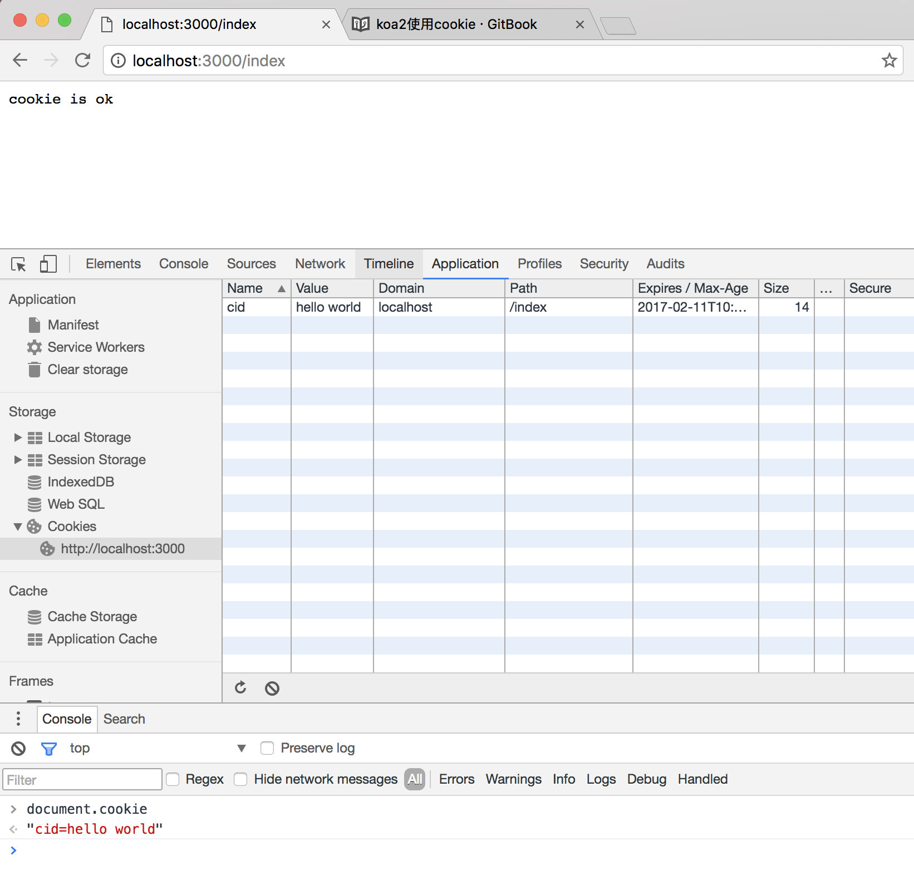

# koa2使用cookie

## 使用方法

koa提供了从上下文直接读取、写入cookie的方法
- ctx.cookies.get(name, [options]) 读取上下文请求中的cookie
- ctx.cookies.set(name, value, [options]) 在上下文中写入cookie

koa2 中操作的cookies是使用了npm的cookies模块，源码在[https://github.com/pillarjs/cookies](https://github.com/pillarjs/cookies)，所以在读写cookie的使用参数与该模块的使用一致。


## 例子代码
``` js
const Koa = require('koa')
const app = new Koa()

app.use( async ( ctx ) => {

  if ( ctx.url === '/index' ) {
    ctx.cookies.set(
      'cid', 
      'hello world',
      {
        domain: 'localhost',  // 写cookie所在的域名
        path: '/index',       // 写cookie所在的路径
        maxAge: 10 * 60 * 1000, // cookie有效时长
        expires: new Date('2017-02-15'),  // cookie失效时间
        httpOnly: false,  // 是否只用于http请求中获取
        overwrite: false  // 是否允许重写
      }
    )
    ctx.body = 'cookie is ok'
  } else {
    ctx.body = 'hello world' 
  }

})

app.listen(3000, () => {
  console.log('[demo] cookie is starting at port 3000')
})


```

## 运行例子

### 执行脚本
```sh
node index.js
```

### 运行结果

#### 访问[http://localhost:3000/index](http://localhost:3000/index)
- 可以在控制台的cookie列表中中看到写在页面上的cookie
- 在控制台的console中使用document.cookie可以打印出在页面的所有cookie（需要是httpOnly设置false才能显示）




