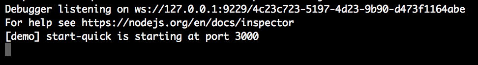
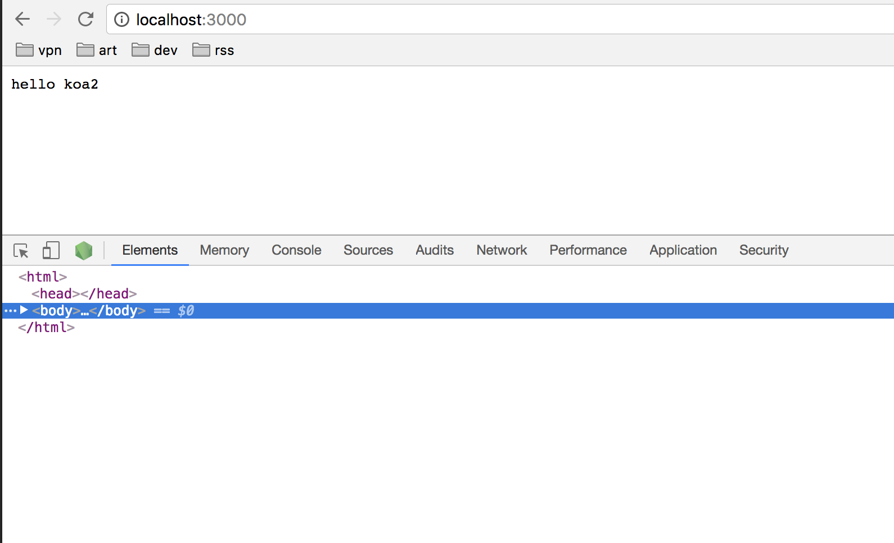
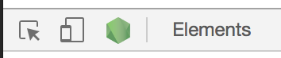
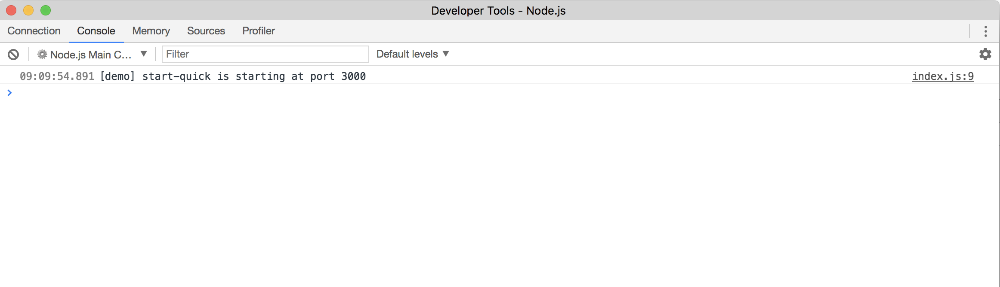
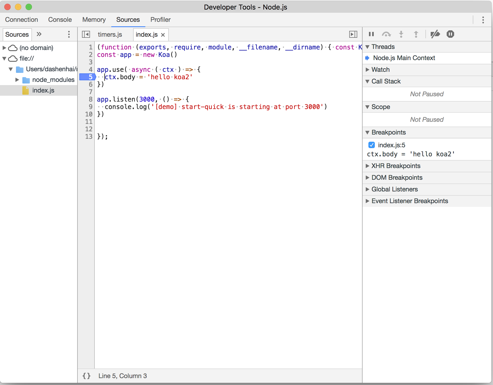
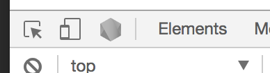
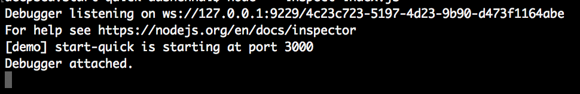
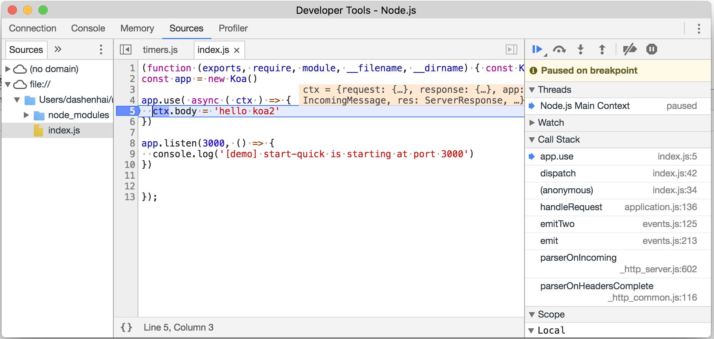

# 开发debug

## 快速开始

### 环境
- node环境 8.x +
- chrome 60+

### 启动脚本

#### 调试demo 

[https://github.com/ChenShenhai/koa2-note/blob/master/demo/start-quick/](https://github.com/ChenShenhai/koa2-note/blob/master/demo/start-quick/index.js)


```
node --inspect index.js
```

#### 指令框显示

> 指令框就会出现以下字样

``` sh
Debugger listening on ws://127.0.0.1:9229/4c23c723-5197-4d23-9b90-d473f1164abe
For help see https://nodejs.org/en/docs/inspector
```


#### 访问chrome浏览器调试server



>  打开浏览器调试窗口会看到一个node.js 的小logo



#### 打开chrome浏览器的node调试窗口




> 注意打开了node的调试窗口后，原来绿色的node按钮会变灰色，同时调试框会显示debug状态





#### 可以自定义打断点调试了


