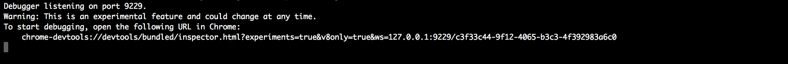
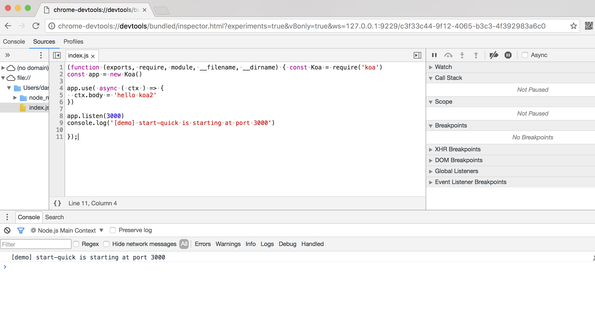
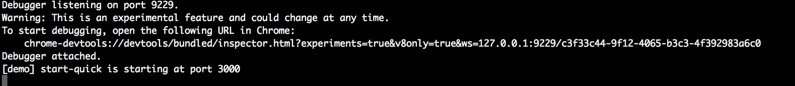

# 开发debug

## 快速开始

### 环境
- node环境 7.x +

### 启动脚本

####调试demo 

[https://github.com/ChenShenhai/koa2-note/blob/master/demo/start-quick/](https://github.com/ChenShenhai/koa2-note/blob/master/demo/start-quick/index.js)

```
node --debug-brk --inspect index.js
```

####指令框就会出现


####指令框中显示的

`chrome-devtools://devtools/bundled/inspector.html?experiments=true&v8only=true&ws=127.0.0.1:9229/c3f33c44-9f12-4065-b3c3-4f392983a6c0`

就是node.js连接chrome调试的连接，让node.js代码的调试和前端js代码一样

> 注意：chrome的debug链接是随机生成的

####访问指令框调试连接，就可以直接在chrome中像前端那样调试node.js代码了


####访问连接后把默认断点打开，就启动了node.js服务


