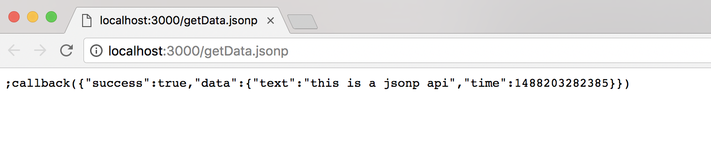
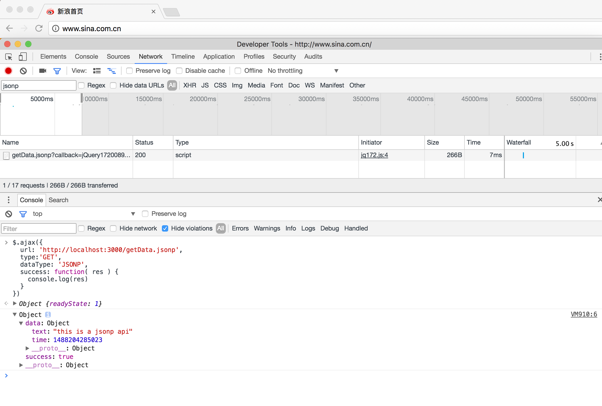

# 原生koa2实现jsonp

## 前言
在项目复杂的业务场景，有时候需要在前端跨域获取数据，这时候提供数据的服务就需要提供跨域请求的接口，通常是使用JSONP的方式提供跨域接口。

## 实现JSONP

demo地址

[https://github.com/ChenShenhai/koa2-note/blob/master/demo/jsonp/](https://github.com/ChenShenhai/koa2-note/blob/master/demo/jsonp/)

### 具体原理
```js

  // 判断是否为JSONP的请求 
  if ( ctx.method === 'GET' && ctx.url.split('?')[0] === '/getData.jsonp') {
    // 获取jsonp的callback
    let callbackName = ctx.query.callback || 'callback'
    let returnData = {
      success: true,
      data: {
        text: 'this is a jsonp api',
        time: new Date().getTime(),
      }
    } 

    // jsonp的script字符串
    let jsonpStr = `;${callbackName}(${JSON.stringify(returnData)})`

    // 用text/javascript，让请求支持跨域获取
    ctx.type = 'text/javascript'

    // 输出jsonp字符串
    ctx.body = jsonpStr
  }  
```
### 解析原理
- JSONP跨域输出的数据是可执行的JavaScript代码
    - ctx输出的类型应该是'text/javascript'
    - ctx输出的内容为可执行的返回数据JavaScript代码字符串
- 需要有回调函数名callbackName，前端获取后会通过动态执行JavaScript代码字符，获取里面的数据


### 效果截图

#### 同域访问JSON请求


#### 跨域访问JSON请求



### 完整demo代码 
```js
const Koa = require('koa')
const app = new Koa()

app.use( async ( ctx ) => {


  // 如果jsonp 的请求为GET
  if ( ctx.method === 'GET' && ctx.url.split('?')[0] === '/getData.jsonp') {

    // 获取jsonp的callback
    let callbackName = ctx.query.callback || 'callback'
    let returnData = {
      success: true,
      data: {
        text: 'this is a jsonp api',
        time: new Date().getTime(),
      }
    }

    // jsonp的script字符串
    let jsonpStr = `;${callbackName}(${JSON.stringify(returnData)})`

    // 用text/javascript，让请求支持跨域获取
    ctx.type = 'text/javascript'

    // 输出jsonp字符串
    ctx.body = jsonpStr

  } else {

    ctx.body = 'hello jsonp'

  }
})

app.listen(3000, () => {
  console.log('[demo] jsonp is starting at port 3000')
})

```