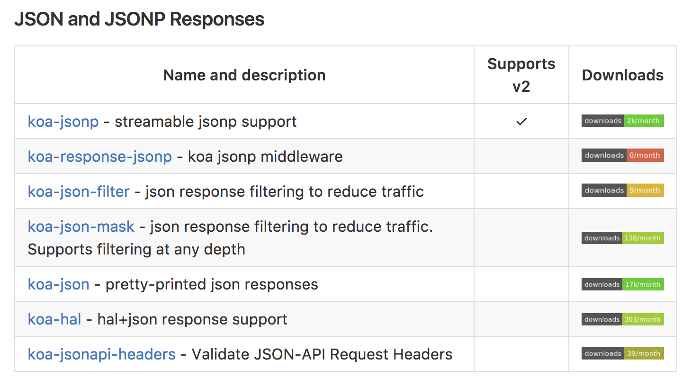

# koa-jsonp中间件

koa.js 官方wiki中也介绍了不少jsonp的中间件


其中koa-jsonp是支持koa2的，使用方式也非常简单，koa-jsonp的官方demo也很容易理解


## 快速使用

demo地址

[https://github.com/ChenShenhai/koa2-note/blob/master/demo/jsonp-use-middleware/](https://github.com/ChenShenhai/koa2-note/blob/master/demo/jsonp-use-middleware/)


### 安装
```sh
npm install --save koa-jsonp
```

### 简单例子
```js
const Koa = require('koa')
const jsonp = require('koa-jsonp')
const app = new Koa()

// 使用中间件
app.use(jsonp())

app.use( async ( ctx ) => {
  
  let returnData = {
    success: true,
    data: {
      text: 'this is a jsonp api',
      time: new Date().getTime(),
    }
  }

  // 直接输出JSON
  ctx.body = returnData
})

app.listen(3000, () => {
  console.log('[demo] jsonp is starting at port 3000')
})

```