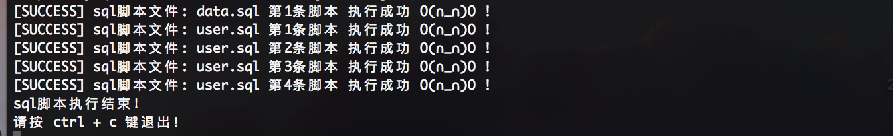
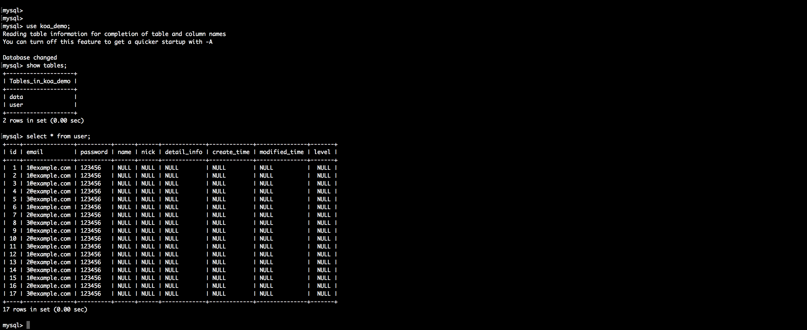

# 建表初始化

## 前言
通常初始化数据库要建立很多表，特别在项目开发的时候表的格式可能会有些变动，这时候就需要封装对数据库建表初始化的方法，保留项目的sql脚本文件，然后每次需要重新建表，则执行建表初始化程序就行

## 快速开始

demo源码

[https://github.com/ChenShenhai/koa2-note/blob/master/demo/mysql/](https://github.com/ChenShenhai/koa2-note/blob/master/demo/mysql/)

### 源码目录

``` sh
├── index.js # 程序入口文件
├── node_modules/
├── package.json
├── sql   # sql脚本文件目录
│   ├── data.sql
│   └── user.sql
└── util    # 工具代码
    ├── db.js # 封装的mysql模块方法
    ├── get-sql-content-map.js # 获取sql脚本文件内容
    ├── get-sql-map.js # 获取所有sql脚本文件
    └── walk-file.js # 遍历sql脚本文件
```

### 具体流程
```sh              
       +---------------------------------------------------+
       |                                                   |
       |   +-----------+   +-----------+   +-----------+   |
       |   |           |   |           |   |           |   |
       |   |           |   |           |   |           |   |
       |   |           |   |           |   |           |   |
       |   |           |   |           |   |           |   |
+----------+  遍历sql  +---+ 解析所有sql +---+  执行sql  +------------>
       |   |  目录下的  |   |  文件脚本  |   |   脚本     |   |
+----------+  sql文件   +---+   内容    +---+           +------------>
       |   |           |   |           |   |           |   |
       |   |           |   |           |   |           |   |
       |   |           |   |           |   |           |   |
       |   |           |   |           |   |           |   |
       |   +-----------+   +-----------+   +-----------+   |
       |                                                   |
       +---------------------------------------------------+

```

## 源码详解

### 数据库操作文件 ./util/db.js
```js
const mysql = require('mysql')

const pool = mysql.createPool({
  host     :  '127.0.0.1',
  user     :  'root',
  password :  'abc123',
  database :  'koa_demo'
})

let query = function( sql, values ) {

  return new Promise(( resolve, reject ) => {
    pool.getConnection(function(err, connection) {
      if (err) {
        reject( err )
      } else {
        connection.query(sql, values, ( err, rows) => {

          if ( err ) {
            reject( err )
          } else {
            resolve( rows )
          }
          connection.release()
        })
      }
    })
  })

}

module.exports = {
  query
}
```

### 获取所有sql脚本内容 ./util/get-sql-content-map.js
```js
const fs = require('fs')
const getSqlMap = require('./get-sql-map')

let sqlContentMap = {}

/**
 * 读取sql文件内容
 * @param  {string} fileName 文件名称
 * @param  {string} path     文件所在的路径
 * @return {string}          脚本文件内容
 */
function getSqlContent( fileName,  path ) {
  let content = fs.readFileSync( path, 'binary' )
  sqlContentMap[ fileName ] = content
}

/**
 * 封装所有sql文件脚本内容
 * @return {object} 
 */
function getSqlContentMap () {
  let sqlMap = getSqlMap()
  for( let key in sqlMap ) {
    getSqlContent( key, sqlMap[key] )
  }

  return sqlContentMap
}

module.exports = getSqlContentMap
```

### 获取sql目录详情 ./util/get-sql-map.js
```js
const fs = require('fs')
const walkFile = require('./walk-file')

/**
 * 获取sql目录下的文件目录数据
 * @return {object} 
 */
function getSqlMap () {
  let basePath = __dirname
  basePath = basePath.replace(/\\/g, '\/')

  let pathArr = basePath.split('\/')
  pathArr = pathArr.splice( 0, pathArr.length - 1 )
  basePath = pathArr.join('/') + '/sql/'

  let fileList = walkFile( basePath, 'sql' )
  return fileList
}

module.exports = getSqlMap
```

### 遍历目录操作 ./util/walk-file.js
```js
const fs = require('fs')

/**
 * 遍历目录下的文件目录
 * @param  {string} pathResolve  需进行遍历的目录路径
 * @param  {string} mime         遍历文件的后缀名
 * @return {object}              返回遍历后的目录结果
 */
const walkFile = function(  pathResolve , mime ){

  let files = fs.readdirSync( pathResolve )

  let fileList = {}

   for( let [ i, item] of files.entries() ) {
    let itemArr = item.split('\.')

    let itemMime = ( itemArr.length > 1 ) ? itemArr[ itemArr.length - 1 ] : 'undefined'
    let keyName = item + ''
    if( mime === itemMime ) {
      fileList[ item ] =  pathResolve + item
    }
  }

  return fileList
}

module.exports = walkFile
```

### 入口文件 ./index.js
```js

const fs = require('fs');
const getSqlContentMap = require('./util/get-sql-content-map');
const { query } = require('./util/db');


// 打印脚本执行日志
const eventLog = function( err , sqlFile, index ) {
  if( err ) {
    console.log(`[ERROR] sql脚本文件: ${sqlFile} 第${index + 1}条脚本 执行失败 o(╯□╰)o ！`)
  } else {
    console.log(`[SUCCESS] sql脚本文件: ${sqlFile} 第${index + 1}条脚本 执行成功 O(∩_∩)O !`)
  }
}

// 获取所有sql脚本内容
let sqlContentMap = getSqlContentMap()

// 执行建表sql脚本
const createAllTables = async () => {
  for( let key in sqlContentMap ) {
    let sqlShell = sqlContentMap[key]
    let sqlShellList = sqlShell.split(';')

    for ( let [ i, shell ] of sqlShellList.entries() ) {
      if ( shell.trim() ) {
        let result = await query( shell )
        if ( result.serverStatus * 1 === 2 ) {
          eventLog( null,  key, i)
        } else {
          eventLog( true,  key, i) 
        }
      }
    }
  }
  console.log('sql脚本执行结束！')
  console.log('请按 ctrl + c 键退出！')

}

createAllTables()
```

### sql脚本文件 ./sql/data.sql
```sql
CREATE TABLE   IF NOT EXISTS  `data` (
  `id` int(11) NOT NULL AUTO_INCREMENT,
  `data_info` json DEFAULT NULL,
  `create_time` varchar(20) DEFAULT NULL,
  `modified_time` varchar(20) DEFAULT NULL,
  `level` int(11) DEFAULT NULL,
  PRIMARY KEY (`id`)
) ENGINE=InnoDB DEFAULT CHARSET=utf8
```

### sql脚本文件 ./sql/user.sql
```sql
CREATE TABLE   IF NOT EXISTS  `user` (
  `id` int(11) NOT NULL AUTO_INCREMENT,
  `email` varchar(255) DEFAULT NULL,
  `password` varchar(255) DEFAULT NULL,
  `name` varchar(255) DEFAULT NULL,
  `nick` varchar(255) DEFAULT NULL,
  `detail_info` json DEFAULT NULL,
  `create_time` varchar(20) DEFAULT NULL,
  `modified_time` varchar(20) DEFAULT NULL,
  `level` int(11) DEFAULT NULL,
  PRIMARY KEY (`id`)
) ENGINE=InnoDB DEFAULT CHARSET=utf8;

INSERT INTO `user` set email='1@example.com', password='123456';
INSERT INTO `user` set email='2@example.com', password='123456';
INSERT INTO `user` set email='3@example.com', password='123456';
```


## 效果

### 执行脚本
```
node index.js
```

### 执行结果


### 查看数据库写入数据


