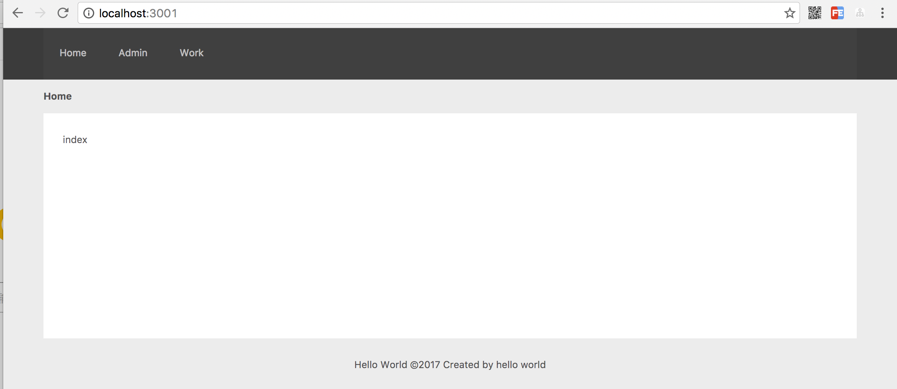

# 使用react.js 

## react.js简介

react.js 是作为前端渲染的js库（注意：不是框架）。react.js用JSX开发来描述DOM结构，通过编译成virtual dom的在浏览器中进行view渲染和动态交互处理。更多了解可查阅GitHub[https://facebook.github.io/react/](https://facebook.github.io/react/)

## 编译使用
由于react.js开发过程用JSX编程，无法直接在浏览器中运行，需要编译成浏览器可识别运行的virtual dom。从JSX开发到运行，需要有一个编译的过程。目前最常用的方案是用webpack + babel进行编译打包。

## 前端待编译源文件目录
demos/project/static/
```sh
.
├── build # 编译的webpack脚本
│   ├── webpack.base.config.js
│   ├── webpack.dev.config.js
│   └── webpack.prod.config.js
├── output # 输出文件
│   ├── asset
│   ├── dist #  react.js编译后的文件目录
│   └── ...
└── src
   ├── apps # 页面react.js应用
   │   ├── admin.jsx
   │   ├── error.jsx
   │   ├── index.jsx
   │   └── work.jsx
   ├── components # jsx 模块、组件
   │   ├── footer-common.jsx
   │   ├── form-group.jsx
   │   ├── header-nav.jsx
   │   ├── sign-in-form.jsx
   │   └── sign-up-form.jsx
   └── pages # react.js 执行render文件目录
       ├── admin.js
       ├── error.js
       ├── index.js
       └── work.js
        ...
```


### react.js页面应用文件
static/src/apps/index.jsx 文件
``` jsx
import React from 'react'
import ReactDOM from 'react-dom'
import { Layout, Menu, Breadcrumb } from 'antd'
import HeadeNav from './../components/header-nav.jsx'
import FooterCommon from './../components/footer-common.jsx'
import 'antd/lib/layout/style/css'

const { Header, Content, Footer } = Layout

class App extends React.Component {
  render() {
    return (
      <Layout className="layout">
        <HeadeNav/>
        <Content style={{ padding: '0 50px' }}>
          <Breadcrumb style={{ margin: '12px 0' }}>
            <Breadcrumb.Item>Home</Breadcrumb.Item>
          </Breadcrumb>
          <div style={{ background: '#fff', padding: 24, minHeight: 280 }}>
            <p>index</p>
          </div>
        </Content>
        <FooterCommon />
      </Layout>
    )
  }
}
export default App
```

### react.js执行render渲染
static/src/pages/index.js 文件
```js
import React from 'react'
import ReactDOM from 'react-dom'
import App from './../apps/index.jsx'

ReactDOM.render( <App />,
  document.getElementById("app"))
```

### 静态页面引用react.js编译后文件
```sh
<!DOCTYPE html>
<html>
<head>
    <title><%= title %></title>
    <link rel="stylesheet" href="/output/dist/css/index.css">
</head>
<body>
    <div id="app"></div>
    <script src="/output/dist/js/vendor.js"></script>
    <script src="/output/dist/js/index.js"></script>
</body>
</html>
```


### 页面渲染效果


