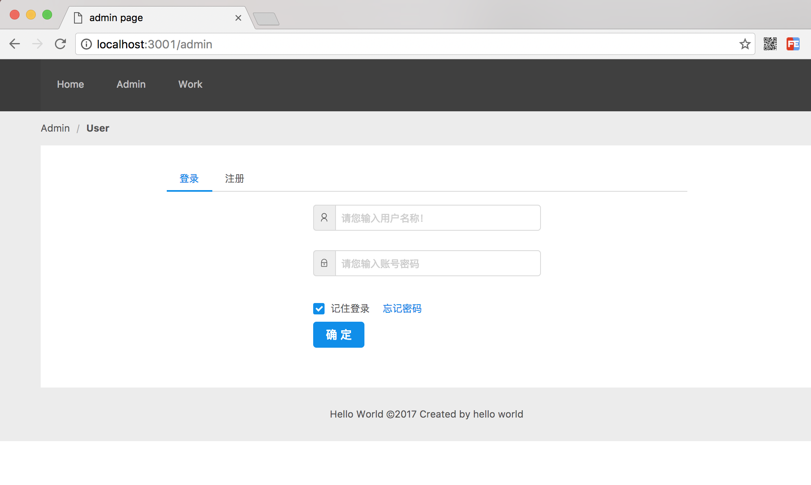

# 登录注册功能实现

## 用户模型dao操作
```js
/**
   * 数据库创建用户
   * @param  {object} model 用户数据模型
   * @return {object}       mysql执行结果
   */
  async create ( model ) {
    let result = await dbUtils.insertData( 'user_info', model )
    return result
  },

  /**
   * 查找一个存在用户的数据
   * @param  {obejct} options 查找条件参数
   * @return {object|null}        查找结果
   */
  async getExistOne(options ) {
    let _sql = `
    SELECT * from user_info
      where email="${options.email}" or name="${options.name}"
      limit 1`
    let result = await dbUtils.query( _sql )
    if ( Array.isArray(result) && result.length > 0 ) {
      result = result[0]
    } else {
      result = null
    }
    return result
  },

  /**
   * 根据用户名和密码查找用户
   * @param  {object} options 用户名密码对象
   * @return {object|null}         查找结果
   */
  async getOneByUserNameAndPassword( options ) {
    let _sql = `
    SELECT * from user_info
      where password="${options.password}" and name="${options.name}"
      limit 1`
    let result = await dbUtils.query( _sql )
    if ( Array.isArray(result) && result.length > 0 ) {
      result = result[0]
    } else {
      result = null
    }
    return result
  },

  /**
   * 根据用户名查找用户信息
   * @param  {string} userName 用户账号名称
   * @return {object|null}     查找结果
   */
  async getUserInfoByUserName( userName ) {

    let result = await dbUtils.select(
      'user_info',
      ['id', 'email', 'name', 'detail_info', 'create_time', 'modified_time', 'modified_time' ])
    if ( Array.isArray(result) && result.length > 0 ) {
      result = result[0]
    } else {
      result = null
    }
    return result
  },

```


### 业务层操作
```js
/**
   * 创建用户
   * @param  {object} user 用户信息
   * @return {object}      创建结果
   */
  async create( user ) {
    let result = await userModel.create(user)
    return result
  },

  /**
   * 查找存在用户信息
   * @param  {object} formData 查找的表单数据
   * @return {object|null}      查找结果
   */
  async getExistOne( formData ) {
    let resultData = await userModel.getExistOne({
      'email': formData.email,
      'name': formData.userName
    })
    return resultData
  },

  /**
   * 登录业务操作
   * @param  {object} formData 登录表单信息
   * @return {object}          登录业务操作结果
   */
  async signIn( formData ) {
    let resultData = await userModel.getOneByUserNameAndPassword({
      'password': formData.password,
      'name': formData.userName})
    return resultData
  },


  /**
   * 根据用户名查找用户业务操作
   * @param  {string} userName 用户名
   * @return {object|null}     查找结果
   */
  async getUserInfoByUserName( userName ) {
    
    let resultData = await userModel.getUserInfoByUserName( userName ) || {}
    let userInfo = {
      // id: resultData.id,
      email: resultData.email,
      userName: resultData.name,
      detailInfo: resultData.detail_info,
      createTime: resultData.create_time
    }
    return userInfo
  },


  /**
   * 检验用户注册数据
   * @param  {object} userInfo 用户注册数据
   * @return {object}          校验结果
   */
  validatorSignUp( userInfo ) {
    let result = {
      success: false,
      message: '',
    }

    if ( /[a-z0-9\_\-]{6,16}/.test(userInfo.userName) === false ) {
      result.message = userCode.ERROR_USER_NAME
      return result
    }
    if ( !validator.isEmail( userInfo.email ) ) {
      result.message = userCode.ERROR_EMAIL
      return result
    }
    if ( !/[\w+]{6,16}/.test( userInfo.password )  ) {
      result.message = userCode.ERROR_PASSWORD
      return result
    }
    if ( userInfo.password !== userInfo.confirmPassword ) {
      result.message = userCode.ERROR_PASSWORD_CONFORM
      return result
    }

    result.success = true

    return result
  }
```

### controller 操作
```js
 /**
   * 登录操作
   * @param  {obejct} ctx 上下文对象
   */
  async signIn( ctx ) {
    let formData = ctx.request.body
    let result = {
      success: false,
      message: '',
      data: null,
      code: ''
    }

    let userResult = await userInfoService.signIn( formData )

    if ( userResult ) {
      if ( formData.userName === userResult.name ) {
        result.success = true
      } else {
        result.message = userCode.FAIL_USER_NAME_OR_PASSWORD_ERROR
        result.code = 'FAIL_USER_NAME_OR_PASSWORD_ERROR'
      }
    } else {
      result.code = 'FAIL_USER_NO_EXIST',
      result.message = userCode.FAIL_USER_NO_EXIST
    }

    if ( formData.source === 'form' && result.success === true ) {
      let session = ctx.session
      session.isLogin = true
      session.userName = userResult.name
      session.userId = userResult.id

      ctx.redirect('/work')
    } else {
      ctx.body = result
    }
  },

  /**
   * 注册操作
   * @param   {obejct} ctx 上下文对象
   */
  async signUp( ctx ) {
    let formData = ctx.request.body
    let result = {
      success: false,
      message: '',
      data: null
    }

    let validateResult = userInfoService.validatorSignUp( formData )

    if ( validateResult.success === false ) {
      result = validateResult
      ctx.body = result
      return
    }

    let existOne  = await userInfoService.getExistOne(formData)
    console.log( existOne )

    if ( existOne  ) {
      if ( existOne .name === formData.userName ) {
        result.message = userCode.FAIL_USER_NAME_IS_EXIST
        ctx.body = result
        return
      }
      if ( existOne .email === formData.email ) {
        result.message = userCode.FAIL_EMAIL_IS_EXIST
        ctx.body = result
        return
      }
    }


    let userResult = await userInfoService.create({
      email: formData.email,
      password: formData.password,
      name: formData.userName,
      create_time: new Date().getTime(),
      level: 1,
    })

    console.log( userResult )

    if ( userResult && userResult.insertId * 1 > 0) {
      result.success = true
    } else {
      result.message = userCode.ERROR_SYS
    }

    ctx.body = result
  },
```

### api路由操作
```js
const router = require('koa-router')()
const userInfoController = require('./../controllers/user-info')

const routers = router
  .get('/user/getUserInfo.json', userInfoController.getLoginUserInfo)
  .post('/user/signIn.json', userInfoController.signIn)
  .post('/user/signUp.json', userInfoController.signUp)
```

## 前端用react.js实现效果

登录模式

注册模式

