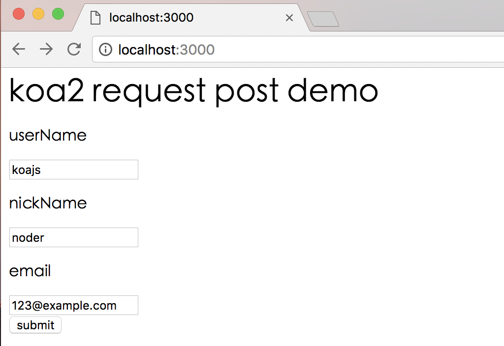
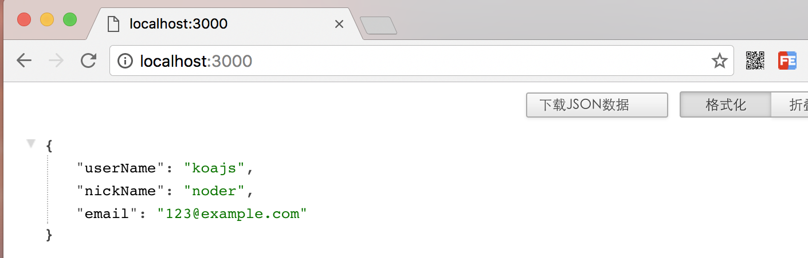

# koa-bodyparser中间件

## 原理
对于POST请求的处理，koa-bodyparser中间件可以把koa2上下文的formData数据解析到ctx.request.body中

### 安装koa2版本的koa-bodyparser@3中间件
```sh
npm install --save koa-bodyparser@3
```

## 举个例子

### 例子代码

demo源码

 [https://github.com/ChenShenhai/koa2-note/blob/master/demo/request/post-middleware.js](https://github.com/ChenShenhai/koa2-note/blob/master/demo/request/post-middleware.js)

```js
const Koa = require('koa')
const app = new Koa()
const bodyParser = require('koa-bodyparser')

// 使用ctx.body解析中间件
app.use(bodyParser())

app.use( async ( ctx ) => {

  if ( ctx.url === '/' && ctx.method === 'GET' ) {
    // 当GET请求时候返回表单页面
    let html = `
      <h1>koa2 request post demo</h1>
      <form method="POST" action="/">
        <p>userName</p>
        <input name="userName" /><br/>
        <p>nickName</p>
        <input name="nickName" /><br/>
        <p>email</p>
        <input name="email" /><br/>
        <button type="submit">submit</button>
      </form>
    `
    ctx.body = html
  } else if ( ctx.url === '/' && ctx.method === 'POST' ) {
    // 当POST请求的时候，中间件koa-bodyparser解析POST表单里的数据，并显示出来
    let postData = ctx.request.body
    ctx.body = postData
  } else {
    // 其他请求显示404
    ctx.body = '<h1>404！！！ o(╯□╰)o</h1>'
  }
})

app.listen(3000, () => {
  console.log('[demo] request post is starting at port 3000')
})

```

### 启动例子
```sh
node post-middleware.js
```

### 访问页面


### 提交表单发起POST请求结果显示

