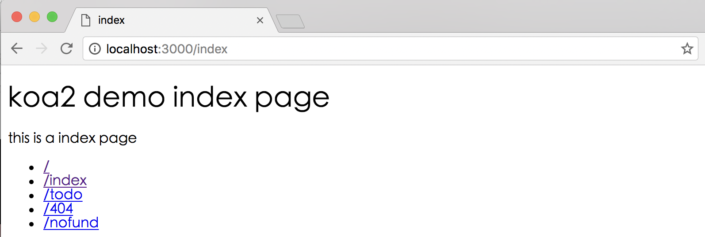

# koa2 原生路由实现


## 简单例子
```js
const Koa = require('koa')
const app = new Koa()

app.use( async ( ctx ) => {
  let url = ctx.request.url
  ctx.body = url
})
app.listen(3000)
```

访问 http://localhost:3000/hello/world 页面会输出 /hello/world，也就是说上下文的请求request对象中url之就是当前访问的路径名称，可以根据ctx.request.url 通过一定的判断或者正则匹配就可以定制出所需要的路由。


## 定制化的路由
demo源码

[https://github.com/ChenShenhai/koa2-note/tree/master/demo/route-simple](https://github.com/ChenShenhai/koa2-note/tree/master/demo/route-simple)

### 源码文件目录
```
.
├── index.js
├── package.json
└── view
    ├── 404.html
    ├── index.html
    └── todo.html
```

### demo源码

```js
const Koa = require('koa')
const fs = require('fs')
const app = new Koa()

/**
 * 用Promise封装异步读取文件方法
 * @param  {string} page html文件名称
 * @return {promise}      
 */
function render( page ) {
  return new Promise(( resolve, reject ) => {
    let viewUrl = `./view/${page}`
    fs.readFile(viewUrl, "binary", ( err, data ) => {
      if ( err ) {
        reject( err )
      } else {
        resolve( data )
      }
    })
  })
}

/**
 * 根据URL获取HTML内容
 * @param  {string} url koa2上下文的url，ctx.url
 * @return {string}     获取HTML文件内容
 */
async function route( url ) {
  let view = '404.html'
  switch ( url ) {
    case '/':
      view = 'index.html'
      break
    case '/index':
      view = 'index.html'
      break
    case '/todo':
      view = 'todo.html'
      break
    case '/404':
      view = '404.html'
      break
    default:
      break
  }
  let html = await render( view )
  return html
}

app.use( async ( ctx ) => {
  let url = ctx.request.url
  let html = await route( url )
  ctx.body = html
})

app.listen(3000)
console.log('[demo] route-simple is starting at port 3000')

```

### 运行demo
#### 执行运行脚本
```sh
node -harmony index.js
```

#### 运行效果如下
访问[http://localhost:3000/index](http://localhost:3000/index)
