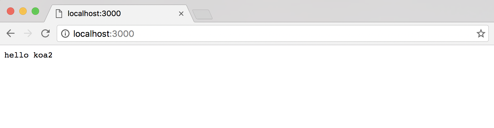

# koa2 快速开始

## 环境准备
- 因为node.js v7.6.0开始完全支持async/await，不需要加flag，所以node.js环境都要7.6.0以上
- node.js环境 版本v7.6以上
    - 直接安装node.js 7.6：node.js官网地址[https://nodejs.org](https://nodejs.org) 
    - nvm管理多版本node.js：可以用nvm 进行node版本进行管理
        - Mac系统安装nvm [https://github.com/creationix/nvm#manual-install](https://github.com/creationix/nvm#manual-install)
        - windows系统安装nvm [https://github.com/coreybutler/nvm-windows](https://github.com/coreybutler/nvm-windows)
        - Ubuntu系统安装nvm [https://github.com/creationix/nvm](https://github.com/creationix/nvm)
- npm 版本3.x以上 


## 快速开始

### 安装koa2 
```sh
# 初始化package.json
npm init

# 安装koa2 
npm install koa

```

### hello world 代码

```js
const Koa = require('koa')
const app = new Koa()

app.use( async ( ctx ) => {
  ctx.body = 'hello koa2'
})

app.listen(3000)
console.log('[demo] start-quick is starting at port 3000')
```

### 启动demo

由于koa2是基于async/await操作中间件，目前node.js 7.x的harmony模式下才能使用，所以启动的时的脚本如下：

```sh
node index.js
```

访问[http:localhost:3000](http:localhost:3000)，效果如下



