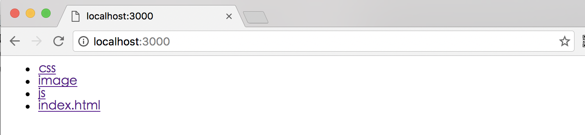
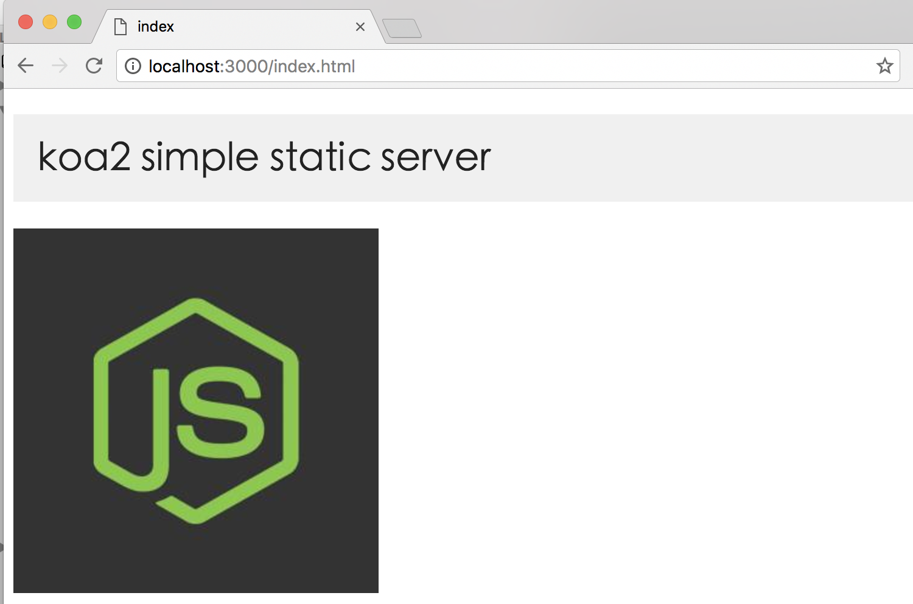
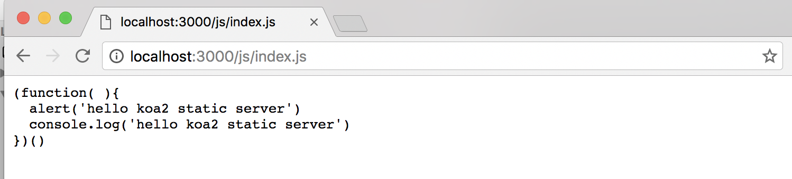

# 原生koa2实现静态资源服务器

## 前言
一个http请求访问web服务静态资源，一般响应结果有三种情况
- 访问文本，例如js，css，png，jpg，gif
- 访问静态目录
- 找不到资源，抛出404错误

## 原生koa2 静态资源服务器例子

demo源码 

[https://github.com/ChenShenhai/koa2-note/blob/master/demo/static-server/](https://github.com/ChenShenhai/koa2-note/blob/master/demo/static-server/)

### 代码目录
```sh
├── static # 静态资源目录
│   ├── css/
│   ├── image/
│   ├── js/
│   └── index.html
├── util # 工具代码
│   ├── content.js # 读取请求内容
│   ├── dir.js # 读取目录内容
│   ├── file.js # 读取文件内容
│   ├── mimes.js # 文件类型列表
│   └── walk.js # 遍历目录内容
└── index.js # 启动入口文件
```


### 代码解析
#### index.js
```js
const Koa = require('koa')
const path = require('path')
const content = require('./util/content')
const mimes = require('./util/mimes')

const app = new Koa()

// 静态资源目录对于相对入口文件index.js的路径
const staticPath = './static'

// 解析资源类型
function parseMime( url ) {
  let extName = path.extname( url )
  extName = extName ?  extName.slice(1) : 'unknown'
  return  mimes[ extName ]
}

app.use( async ( ctx ) => {
  // 静态资源目录在本地的绝对路径
  let fullStaticPath = path.join(__dirname, staticPath)

  // 获取静态资源内容，有可能是文件内容，目录，或404
  let _content = await content( ctx, fullStaticPath )

  // 解析请求内容的类型
  let _mime = parseMime( ctx.url )

  // 如果有对应的文件类型，就配置上下文的类型
  if ( _mime ) {
    ctx.type = _mime
  }

  // 输出静态资源内容
  if ( _mime && _mime.indexOf('image/') >= 0 ) {
    // 如果是图片，则用node原生res，输出二进制数据
    ctx.res.writeHead(200)
    ctx.res.write(_content, 'binary')
    ctx.res.end()
  } else {
    // 其他则输出文本
    ctx.body = _content
  }
})

app.listen(3000)
console.log('[demo] static-server is starting at port 3000')
```

#### util/content.js
```js
const path = require('path')
const fs = require('fs')

// 封装读取目录内容方法
const dir = require('./dir')

// 封装读取文件内容方法
const file = require('./file')


/**
 * 获取静态资源内容
 * @param  {object} ctx koa上下文
 * @param  {string} 静态资源目录在本地的绝对路径
 * @return  {string} 请求获取到的本地内容
 */
async function content( ctx, fullStaticPath ) {
  
  // 封装请求资源的完绝对径
  let reqPath = path.join(fullStaticPath, ctx.url)

  // 判断请求路径是否为存在目录或者文件
  let exist = fs.existsSync( reqPath )
  
  // 返回请求内容， 默认为空
  let content = ''

  if( !exist ) {
    //如果请求路径不存在，返回404
    content = '404 Not Found! o(╯□╰)o！'
  } else {
    //判断访问地址是文件夹还是文件
    let stat = fs.statSync( reqPath )

    if( stat.isDirectory() ) {
      //如果为目录，则渲读取目录内容
      content = dir( ctx.url, reqPath )

    } else {
      // 如果请求为文件，则读取文件内容
      content = await file( reqPath )
    }
  }

  return content
}

module.exports = content
```


#### util/dir.js
```js
const url = require('url')
const fs = require('fs')
const path = require('path')

// 遍历读取目录内容方法
const walk = require('./walk')

/**
 * 封装目录内容
 * @param  {string} url 当前请求的上下文中的url，即ctx.url
 * @param  {string} reqPath 请求静态资源的完整本地路径
 * @return {string} 返回目录内容，封装成HTML
 */
function dir ( url, reqPath ) {
  
  // 遍历读取当前目录下的文件、子目录
  let contentList = walk( reqPath )

  let html = `<ul>`
  for ( let [ index, item ] of contentList.entries() ) {
    html = `${html}<li><a href="${url === '/' ? '' : url}/${item}">${item}</a>` 
  }
  html = `${html}</ul>`
  
  return html
}

module.exports = dir
```

#### util/file.js
```js
const fs = require('fs')

/**
 * 读取文件方法
 * @param  {string} 文件本地的绝对路径
 * @return {string|binary} 
 */
function file ( filePath ) {

 let content = fs.readFileSync(filePath, 'binary' )
 return content
}

module.exports = file
```

#### util/walk.js
```js
const fs = require('fs')
const mimes = require('./mimes')

/**
 * 遍历读取目录内容（子目录，文件名）
 * @param  {string} reqPath 请求资源的绝对路径
 * @return {array} 目录内容列表
 */
function walk( reqPath ){

  let files = fs.readdirSync( reqPath );

  let dirList = [], fileList = [];
  for( let i=0, len=files.length; i<len; i++ ) {
    let item = files[i];
    let itemArr = item.split("\.");
    let itemMime = ( itemArr.length > 1 ) ? itemArr[ itemArr.length - 1 ] : "undefined";

    if( typeof mimes[ itemMime ] === "undefined" ) {
      dirList.push( files[i] );
    } else {
      fileList.push( files[i] );
    }
  }


  let result = dirList.concat( fileList );

  return result;
};

module.exports = walk;
```


#### util/mime.js
```js
let mimes = {
  'css': 'text/css',
  'less': 'text/css',
  'gif': 'image/gif',
  'html': 'text/html',
  'ico': 'image/x-icon',
  'jpeg': 'image/jpeg',
  'jpg': 'image/jpeg',
  'js': 'text/javascript',
  'json': 'application/json',
  'pdf': 'application/pdf',
  'png': 'image/png',
  'svg': 'image/svg+xml',
  'swf': 'application/x-shockwave-flash',
  'tiff': 'image/tiff',
  'txt': 'text/plain',
  'wav': 'audio/x-wav',
  'wma': 'audio/x-ms-wma',
  'wmv': 'video/x-ms-wmv',
  'xml': 'text/xml'
}

module.exports = mimes

```


### 运行效果

#### 启动服务
```sh
node index.js
```

#### 效果

##### 访问[http://localhost:3000](http://localhost:3000)


##### 访问[http://localhost:3000/index.html](http://localhost:3000/index.html)


##### 访问[http://localhost:3000/js/index.js](http://localhost:3000/js/index.js)



