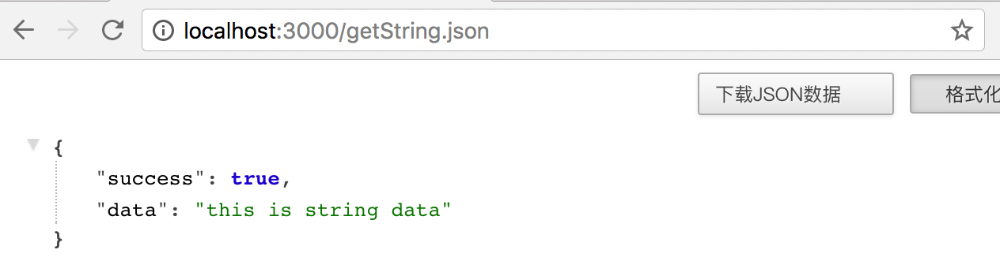
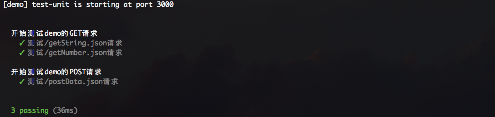

# 单元测试

## 前言

测试是一个项目周期里必不可少的环节，开发者在开发过程中也是无时无刻进行“人工测试”，如果每次修改一点代码，都要牵一发动全身都要手动测试关联接口，这样子是禁锢了生产力。为了解放大部分测试生产力，相关的测试框架应运而生，比较出名的有mocha，karma，jasmine等。虽然框架繁多，但是使用起来都是大同小异。


## 准备工作

### 安装测试相关框架

```sh
npm install --save-dev mocha chai supertest
```

- mocha 模块是测试框架
- chai 模块是用来进行测试结果断言库，比如一个判断 1 + 1 是否等于 2
- supertest 模块是http请求测试库，用来请求API接口

## 测试例子

demo地址

[https://github.com/ChenShenhai/koa2-note/blob/master/demo/test-unit/](https://github.com/ChenShenhai/koa2-note/blob/master/demo/test-unit/)

### 例子目录
```sh
.
├── index.js # api文件
├── package.json
└── test # 测试目录
    └── index.test.js # 测试用例
```


### 所需测试demo
```js
const Koa = require('koa')
const app = new Koa()

const server = async ( ctx, next ) => {
  let result = {
    success: true,
    data: null
  }

  if ( ctx.method === 'GET' ) { 
    if ( ctx.url === '/getString.json' ) {
      result.data = 'this is string data'
    } else if ( ctx.url === '/getNumber.json' ) {
      result.data = 123456
    } else {
      result.success = false
    }
    ctx.body = result
    next && next()
  } else if ( ctx.method === 'POST' ) {
    if ( ctx.url === '/postData.json' ) {
      result.data = 'ok'
    } else {
      result.success = false
    }
    ctx.body = result
    next && next()
  } else {
    ctx.body = 'hello world'
    next && next()
  }
}

app.use(server)

module.exports = app

app.listen(3000, () => {
  console.log('[demo] test-unit is starting at port 3000')
})

```

启动服务后访问接口会看到以下数据

[http://localhost:3000/getString.json](http://localhost:3000/getString.json)




### 开始写测试用例

demo/test-unit/test/index.test.js

```js
const supertest = require('supertest')
const chai = require('chai')
const app = require('./../index')

const expect = chai.expect
const request = supertest( app.listen() )

// 测试套件/组
describe( '开始测试demo的GET请求', ( ) => {
  
  // 测试用例
  it('测试/getString.json请求', ( done ) => {
      request
        .get('/getString.json')
        .expect(200)
        .end(( err, res ) => {
            // 断言判断结果是否为object类型
            expect(res.body).to.be.an('object')
            expect(res.body.success).to.be.an('boolean')
            expect(res.body.data).to.be.an('string')
            done()
        })
  })
})
```

### 执行测试用例

```sh
# node.js <= 7.5.x
./node_modules/.bin/mocha  --harmony

# node.js = 7.6.0
./node_modules/.bin/mocha
```

> 注意：
> 1. 如果是全局安装了mocha，可以直接在当前项目目录下执行 mocha --harmony 命令
> 2. 如果当前node.js版本低于7.6，由于7.5.x以下还直接不支持async/awiar就需要加上--harmony
> 

会自动读取执行命令 ./test 目录下的测用例文件 inde.test.js，并执行。测试结果如下


### 用例详解

#### 服务入口加载
如果要对一个服务的API接口，进行单元测试，要用supertest加载服务的入口文件
```js
const supertest = require('supertest')
const request = supertest( app.listen() )
```

#### 测试套件、用例
- describe()描述的是一个测试套件
- 嵌套在describe()的it()是对接口进行自动化测试的测试用例
- 一个describe()可以包含多个it()
```js
describe( '开始测试demo的GET请求', ( ) => {
    it('测试/getString.json请求', () => {
        // TODO ...
    })
})
```
- supertest封装服务request，是用来请求接口
- chai.expect使用来判断测试结果是否与预期一样
    - chai 断言有很多种方法，这里只是用了数据类型断言  


