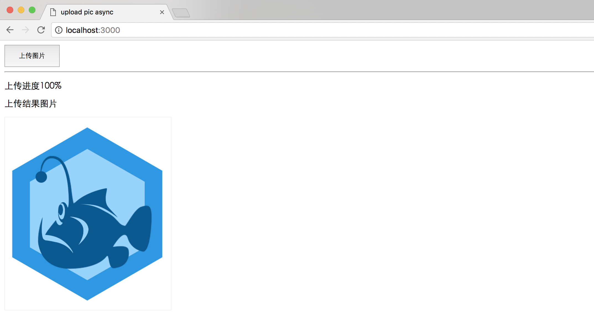

# 异步上传图片实现

## 快速上手

demo 地址

[https://github.com/ChenShenhai/koa2-note/tree/master/demo/upload-async](https://github.com/ChenShenhai/koa2-note/tree/master/demo/upload-async)

## 源码理解

### demo源码目录
```sh
.
├── index.js # 后端启动文件
├── node_modules
├── package.json
├── static # 静态资源目录
│   ├── image # 异步上传图片存储目录
│   └── js
│       └── index.js # 上传图片前端js操作
├── util
│   └── upload.js # 后端处理图片流操作
└── view
    └── index.ejs # ejs后端渲染模板
```


### 后端代码
入口文件 demo/upload-async/index.js
```js
const Koa = require('koa')
const views = require('koa-views')
const path = require('path')
const convert = require('koa-convert')
const static = require('koa-static')
const { uploadFile } = require('./util/upload')

const app = new Koa()

/**
 * 使用第三方中间件 start 
 */
app.use(views(path.join(__dirname, './view'), {
  extension: 'ejs'
}))

// 静态资源目录对于相对入口文件index.js的路径
const staticPath = './static'
// 由于koa-static目前不支持koa2
// 所以只能用koa-convert封装一下
app.use(convert(static(
  path.join( __dirname,  staticPath)
)))
/**
 * 使用第三方中间件 end 
 */

app.use( async ( ctx ) => {
  if ( ctx.method === 'GET' ) {
    let title = 'upload pic async'
    await ctx.render('index', {
      title,
    })
  } else if ( ctx.url === '/api/picture/upload.json' && ctx.method === 'POST' ) {
    // 上传文件请求处理
    let result = { success: false }
    let serverFilePath = path.join( __dirname, 'static/image' )

    // 上传文件事件
    result = await uploadFile( ctx, {
      fileType: 'album',
      path: serverFilePath
    })
    ctx.body = result
  } else {
    // 其他请求显示404
    ctx.body = '<h1>404！！！ o(╯□╰)o</h1>'
  }
  
})

app.listen(3000, () => {
  console.log('[demo] upload-pic-async is starting at port 3000')
})


```

后端上传图片流写操作
入口文件 demo/upload-async/util/upload.js

```js
const inspect = require('util').inspect
const path = require('path')
const os = require('os')
const fs = require('fs')
const Busboy = require('busboy')

/**
 * 同步创建文件目录
 * @param  {string} dirname 目录绝对地址
 * @return {boolean}        创建目录结果
 */
function mkdirsSync( dirname ) {
  if (fs.existsSync( dirname )) {
    return true
  } else {
    if (mkdirsSync( path.dirname(dirname)) ) {
      fs.mkdirSync( dirname )
      return true
    }
  }
}

/**
 * 获取上传文件的后缀名
 * @param  {string} fileName 获取上传文件的后缀名
 * @return {string}          文件后缀名
 */
function getSuffixName( fileName ) {
  let nameList = fileName.split('.')
  return nameList[nameList.length - 1]
}

/**
 * 上传文件
 * @param  {object} ctx     koa上下文
 * @param  {object} options 文件上传参数 fileType文件类型， path文件存放路径
 * @return {promise}         
 */
function uploadFile( ctx, options) {
  let req = ctx.req
  let res = ctx.res
  let busboy = new Busboy({headers: req.headers})

  // 获取类型
  let fileType = options.fileType || 'common'
  let filePath = path.join( options.path,  fileType)
  let mkdirResult = mkdirsSync( filePath )
  
  return new Promise((resolve, reject) => {
    console.log('文件上传中...')
    let result = { 
      success: false,
      message: '',
      data: null
    }

    // 解析请求文件事件
    busboy.on('file', function(fieldname, file, filename, encoding, mimetype) {
      let fileName = Math.random().toString(16).substr(2) + '.' + getSuffixName(filename)
      let _uploadFilePath = path.join( filePath, fileName )
      let saveTo = path.join(_uploadFilePath)

      // 文件保存到制定路径
      file.pipe(fs.createWriteStream(saveTo))

      // 文件写入事件结束
      file.on('end', function() {
        result.success = true
        result.message = '文件上传成功'
        result.data = {
          pictureUrl: `//${ctx.host}/image/${fileType}/${fileName}`
        }
        console.log('文件上传成功！')
        resolve(result)
      })
    })

    // 解析结束事件
    busboy.on('finish', function( ) {
      console.log('文件上结束')
      resolve(result)
    })

    // 解析错误事件
    busboy.on('error', function(err) {
      console.log('文件上出错')
      reject(result)
    })

    req.pipe(busboy)
  })
    
} 

module.exports =  {
  uploadFile
}
```

### 前端代码
```html
<button class="btn" id="J_UploadPictureBtn">上传图片</button>
<hr/>
<p>上传进度<span id="J_UploadProgress">0</span>%</p>
<p>上传结果图片</p>
<div id="J_PicturePreview" class="preview-picture">
</div>
<script src="/js/index.js"></script>
```

上传操作代码
```js
(function(){

let btn = document.getElementById('J_UploadPictureBtn')
let progressElem = document.getElementById('J_UploadProgress')
let previewElem = document.getElementById('J_PicturePreview')
btn.addEventListener('click', function(){
  uploadAction({
    success: function( result ) {
      console.log( result )
      if ( result && result.success && result.data && result.data.pictureUrl ) {
        previewElem.innerHTML = ''
      }
    },
    progress: function( data ) {
      if ( data && data * 1 > 0 ) {
        progressElem.innerText = data
      }
    }
  })
})


/**
 * 类型判断
 * @type {Object}
 */
let UtilType = {
  isPrototype: function( data ) {
    return Object.prototype.toString.call(data).toLowerCase();
  },

  isJSON: function( data ) {
    return this.isPrototype( data ) === '[object object]';
  },

  isFunction: function( data ) {
    return this.isPrototype( data ) === '[object function]';
  }
}

/**
 * form表单上传请求事件
 * @param  {object} options 请求参数
 */
function requestEvent( options ) {
  try {
    let formData = options.formData
    let xhr = new XMLHttpRequest()
    xhr.onreadystatechange = function() {

      if ( xhr.readyState === 4 && xhr.status === 200 ) {
        options.success(JSON.parse(xhr.responseText))
      } 
    }

    xhr.upload.onprogress = function(evt) {
      let loaded = evt.loaded
      let tot = evt.total
      let per = Math.floor(100 * loaded / tot) 
      options.progress(per)
    }
    xhr.open('post', '/api/picture/upload.json')
    xhr.send(formData)
  } catch ( err ) {
    options.fail(err)
  }
}

/**
 * 上传事件
 * @param  {object} options 上传参数      
 */
function uploadEvent ( options ){
  let file
  let formData = new FormData()
  let input = document.createElement('input')
  input.setAttribute('type', 'file')
  input.setAttribute('name', 'files')

  input.click()
  input.onchange = function () {
    file = input.files[0]
    formData.append('files', file)

    requestEvent({
      formData,
      success: options.success,
      fail: options.fail,
      progress: options.progress
    })  
  }

}

/**
 * 上传操作
 * @param  {object} options 上传参数     
 */
function uploadAction( options ) {
  if ( !UtilType.isJSON( options ) ) {
    console.log( 'upload options is null' )
    return
  }
  let _options = {}
  _options.success = UtilType.isFunction(options.success) ? options.success : function() {}
  _options.fail = UtilType.isFunction(options.fail) ? options.fail : function() {}
  _options.progress = UtilType.isFunction(options.progress) ? options.progress : function() {}
  
  uploadEvent(_options)
}


})()

```

### 运行效果


